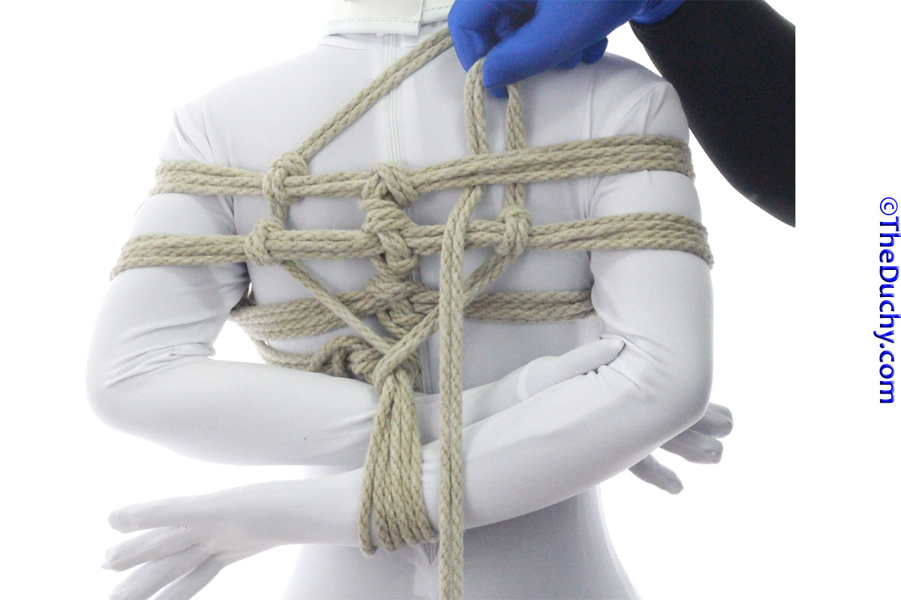

## [X-3TK: Gote Shibari - TheDuchy](https://www.theduchy.com/gote-shibari/#3tk)

3rd Rope Option 2 - The "3TK", aka "X-3TK" (Usually, if someone just says "3TK", they mean this.

-  1. After locking off the friction that secures the Kannuki lines, reach through between the body and arm on the left side and grab the tail…
-  2. …pull the tail through
-  3. Run it across the chest to the opposite shoulder. If your partner has a different body type than is in this picture, this line may end up laying straight across the chest near the nipples. To see how this lays on a different body type, check out the video version
-  4. Bring the tail to the opposite side again
-  5. Now we are going to do a series of Crossing Hitches. The trick to remembering which way to do them for a 3TK is to always put you fingers under the strap on the side of the tail that is closer the the center line, as I am doing here
-  6. Pull the tail through
-  7. Lay it over the incoming line
-  8. Reach under the strap again. Grab the tail
-  9. And pull it through to complete the Crossing Hitch. This BTW is just the regular “Crossing Hitch”. We will do a Reverse Crossing Hitch on the other side…
-  10. Do a Crossing Hitch on the next strap. Remember that the first move is always on the side nearer the center line
-  3TK-11
-  12. Complete the Crossing Hitch then bring your tail down to the wrists
-  13. Put your fingers through the wrist cuffs pointing toward the other side
-  14. Grab the tail
-  15. Pull it through
-  16. You can add a little tension here now to give the wrist cuffs more support
-  17. Reverse the tension so the tail moves up toward the other side. We are now going to put Crossing Hitches in place going up this side. You can do the same technique as we did on the other side, but if you prefer symmetry and want the Crossing Hitches to be facing the same way, you can use the Reverse Crossing Hitch technique as I will do here. Start by reaching under the strap and grabbing the tail
-  18. You want the tension on the complete knot to be on the outside, so orient the tail side of the loop you are holding on to to be more toward the center line and the line with tension (coming from the wrists), to be on the outside
-  19. Pull just a little of that loop through
-  20. Your fingers are already in the loop, so now…
-  21. …grab the tail with those fingers
-  22. …then pull the tail through. The first time you do this, it will likely turn out loose and sloppy, so you will have to work the knot a little to get it to lay the way you want. With practice, you will be able to do the Reverse Crossing Hitch just as quickly and solidly as the regular Crossing Hitch
-  23. If you need to, adjust the position of this Crossing Hitch so it is the same distance away from the center line as was the other side
-  24. Do a second Reverse Crossing Hitch (or Crossing Hitch if you choose)
-  25. …
-  26. Again, make sure it is positioned symmetrically
-  27. Bring the tail up to cross the other shoulder strap
-  28. …and lock it off with a Crossing Hitch before you proceed
-  29. From there, bring the rope over the shoulder…
-  30. …and cross it over the chest like you did the other. Some people like to put a Crossing Hitch at this crossing point as well, but I don’t see that particularly often
-  31. Bring the tail down through the arms on the inside of the Kannuki
-  32. And bring it to the back
-  33. You can lock it off the center line or with two half hitches on one of the straps on the opposite side.
-  34. If you happen to have rope left over, one option for using it up is to wrap it around the soft belly and then tying that tail off to one of the straps on the back.
-  35. Here is the completed 3TK from the Front
-  36. … and the back

